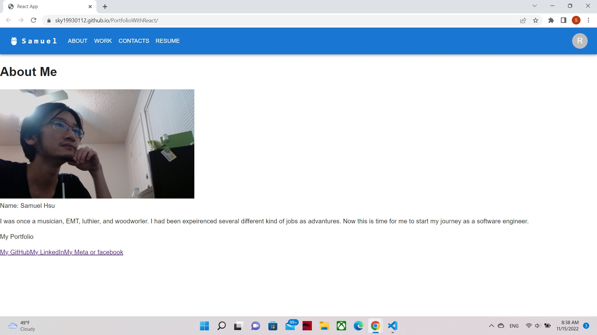

# PortfolioWithReact

Dependencies: 
- "react": "^18.2.0",
- "react-dom": "^18.2.0",
- "react-scripts": "5.0.1",

* I had fix the deploy
* still try to figure out how to fix contact page 
* still try to make the table content change to happen in render.js file in util. I had try couple way to route it but not work it out yet.
* I used template for NavBar from Material UI "App bar with responsive menu"

### Live Site
https://sky19930112.github.io/PortfolioWithReact/

